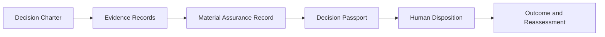

# Materials-to-Mission

**Experimental public baseline · Synthetic examples only · Human-owned decisions**

Materials-to-Mission is Bridge Node 7's public-safe method and validation toolkit for
connecting a consequential mission decision to the material, source, process, evidence,
risk, alternatives, human disposition, action, and proof that support it.

The repository is deliberately bounded. It provides versioned data contracts, a deterministic
CLI, synthetic reference cases, adverse fixtures, a complete Material Assurance Record, and
a concise Decision Passport. It does not publish real supplier intelligence, customer
records, laboratory data, patent-sensitive implementation, restricted technical information,
or operational vulnerabilities.

## One Question

> Does the available evidence justify a defined next action for this material, source,
> process, component, or mission dependency?

## Operating Chain

```text
Signal
→ Source
→ Evidence
→ Requirement
→ Material
→ Origin
→ Process
→ Supplier
→ Facility
→ Component
→ System
→ Mission
→ Risk
→ Weak Link
→ Alternative
→ Qualification Evidence State
→ Mitigation
→ Human Decision
→ Action
→ Outcome
→ Proof
→ Reassessment
```

## How the Records Fit



The complete evidence lineage remains in the Material Assurance Record. The Decision
Passport presents the smallest useful human decision view without replacing that lineage.

## Who This Is For

- Materials and qualification teams evaluating evidence readiness
- Program and mission decision owners managing consequential uncertainty
- Sourcing and supply-chain assurance teams tracing weak links and alternatives
- Researchers and tool builders evaluating portable evidence and decision contracts

These are intended audiences, not claims of current adoption.

## What This Repository Proves

- The public record structure is internally consistent.
- Required evidence and decision fields may be validated.
- Unknown, unsupported, expired, and contradictory evidence remain visible.
- Triggered critical conditions cannot be averaged away.
- A consequential disposition requires a named human owner.
- A concise Decision Passport may be generated deterministically.
- A public release package may be built reproducibly.

## What This Repository Does Not Prove

- Material or supplier qualification
- Certification or compliance
- Legal ownership, origin, or foreign-control determinations
- Production capacity
- Laboratory validity outside the supplied synthetic record
- Customer adoption or commercial readiness
- Government endorsement, funding, selection, or authorization
- Investment merit or guaranteed mission performance

## Choose Your Path

**New to the method?** Read [`docs/START_HERE.md`](docs/START_HERE.md).  
**Evaluating the toolkit?** Follow the [five-minute evaluation](docs/FIVE_MINUTE_EVALUATION.md).  
**Integrating records?** Start with [`SCHEMA_CATALOG.json`](SCHEMA_CATALOG.json) and [`docs/INTEROPERABILITY.md`](docs/INTEROPERABILITY.md).  
**Maintaining or releasing?** Use [`docs/RELEASE_PROCESS.md`](docs/RELEASE_PROCESS.md) and [`docs/ACTION_PIN_PROVENANCE.md`](docs/ACTION_PIN_PROVENANCE.md).
**Checking current maturity?** Read [`docs/CURRENT_STATE.md`](docs/CURRENT_STATE.md) and [`docs/M1_READINESS.md`](docs/M1_READINESS.md).

## Evaluate the Method

Create an isolated environment and install the public toolkit:

```bash
python -m venv .venv
source .venv/bin/activate        # Windows Git Bash: source .venv/Scripts/activate
python -m pip install -r requirements.lock
python -m pip install --no-deps --no-build-isolation -e .
```

Validate and render the synthetic reference:

```bash
m2m validate examples/synthetic-critical-material-pathway/case.json --public
m2m render examples/synthetic-critical-material-pathway/case.json --output build/decision-passport.md
```

Inspect one intentional failure:

```bash
m2m validate examples/invalid/missing-human-owner.json --public --json
```

Expected result: valid JSON findings and exit code `2`, with no traceback.

## Develop or Maintain the Repository

```bash
python -m pip install -r requirements-dev.lock
python -m pip install --no-deps --no-build-isolation -e .
python scripts/check_repo.py
```

Installed commands:

```text
m2m validate   Validate a case and its declared evidence state
m2m render     Render the Decision Passport as Markdown
m2m scan       Scan a JSON record for protected public-boundary tokens
m2m package    Build a deterministic, symlink-rejecting repository archive
m2m schema-dir Print the installed canonical schema directory
```

Packaging safety:

- `m2m package` rejects symbolic links in included paths rather than following them.
- Output must be under excluded `dist/` or `build/`, or outside the release root.
- Repeated packaging is deterministic when the reviewed source is unchanged.

Exit codes:

```text
0  successful result
2  validation or public-boundary finding
3  input, filesystem, or controlled operational error
```

## Core Artifacts

- `schemas/decision-charter.schema.json`
- `schemas/evidence-record.schema.json`
- `schemas/material-assurance-record.schema.json`
- `schemas/decision-passport.schema.json`
- `schemas/case.schema.json`
- `templates/`
- `examples/synthetic-critical-material-pathway/`
- `docs/`

## Decision Artifacts

The **Material Assurance Record** is the complete evidence-bearing record.

The **Decision Passport** is the concise human-facing decision artifact derived from it.

Automation checks structure and declared conditions. **Human authority owns every
consequential conclusion.**

## Public Boundary

All included examples are fictional and synthetic. Public records must not contain real
customer names, supplier identities, samples, lots, facilities, prices, capacities,
vulnerabilities, protected laboratory results, patent-sensitive methods, classified
information, controlled unclassified information, export-controlled technical data, or
other restricted content. See [`docs/PUBLIC_BOUNDARY.md`](docs/PUBLIC_BOUNDARY.md).

## Repository Maturity

`v0.1.0` is an **M0 experimental public method baseline**. It supports public schema,
workflow, and tooling evaluation. Main may contain reviewed unreleased maintenance, but
the repository remains M0 until the real-workflow evidence in
[`docs/M1_READINESS.md`](docs/M1_READINESS.md) is complete. It is not a validated
cross-case commercial product or an authority for certification or qualification.

## Bridge Node 7 Portfolio Fit

- [Bridge Node 7](https://bridgenode7.com/) provides the institutional narrative and public routing.
- **Materials-to-Mission** owns the canonical public method, schemas, validator, and synthetic records.
- [Frontier Decision Engine](https://github.com/Bridge-Node-7/frontier-decision-engine) remains generic decision infrastructure and may later consume this released contract through a thin adapter.
- Real operational cases and protected evidence remain in controlled private systems.

The first website integration is intentionally minimal: one restrained public-method link
from the existing Materials and Readiness experiences after the immutable repository release
passes public readback.

## Security

Do not open a public issue containing sensitive information. Follow [`SECURITY.md`](SECURITY.md)
for private vulnerability reporting.

## License

MIT. The license applies only to content included in this repository. It does not grant
rights to excluded patents, private information, trademarks, or protected operational material.

## Maintainers Only

The `GATES/` directory validates the canonical source and verifies the boundary to a separately
generated exact publication candidate. Public users do not need the release gates to validate or
render cases. Public-write gates exist only in the reviewed publication kit and each requires a
separate authorization.
